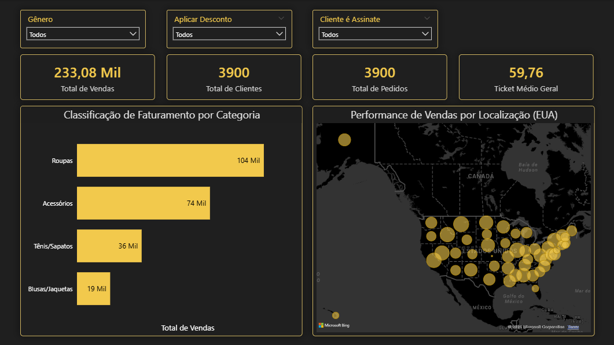

# 📊🛒 Análise de Dados de E-commerce

## 👀 Visão Geral do Projeto
Este projeto apresenta uma **análise de dados aplicada a um cenário de e-commerce**, com foco em **gerar recomendações práticas para a gestão**. A iniciativa simula a atuação de um **Analista de Dados**, abrangendo desde a **organização e tratamento das bases**, análises em **Python e SQL**, até a **construção de dashboards executivos no Power BI**.

O principal objetivo é **traduzir dados operacionais em decisões estratégicas**, utilizando indicadores claros, linguagem acessível à liderança e foco em impacto de negócio.

Dataset utilizado (Kaggle):  
[*Shopping Behavior and Preferences Study*](https://www.kaggle.com/datasets/ranaghulamnabi/shopping-behavior-and-preferences-study)

---

## 🎯 Contexto e Problema de Negócio
Em ambientes de e-commerce, decisões equivocadas sobre **descontos, fidelização e priorização de categorias** podem gerar crescimento artificial de volume, erosão de margem e baixa sustentabilidade no longo prazo.

As principais perguntas de negócio abordadas neste projeto são:

- O crescimento observado é saudável ou depende excessivamente de estímulos promocionais?
- Quais categorias realmente sustentam a receita?
- Descontos estão aumentando valor ou apenas volume?
- Quais perfis de clientes oferecem maior potencial estratégico?

O projeto busca **reduzir incertezas** e apoiar decisões nas áreas de **comercial, marketing e estratégia**.

---

## 📁 Estrutura do Projeto
O projeto foi organizado seguindo boas práticas de análise e versionamento:

- analytics: notebooks com análises exploratórias e métricas  
- data: bases originais e tratadas  
- src: scripts de limpeza e padronização  
- sql: consultas analíticas  
- powerbi: dashboards  
- screenshots: imagens utilizadas na documentação  

📌 Os dashboards utilizam dados tratados localmente.

---

## 🛠️ Etapas do Trabalho

### 🎨 Tratamento e Qualidade dos Dados
- Padronização de colunas  
- Normalização de variáveis categóricas  
- Remoção de duplicados  
- Tratamento de valores nulos  
- Validação de consistência lógica  

Essas etapas garantem que **os indicadores apresentados não estejam distorcidos**, aumentando a confiança das análises para uso executivo.

---

### 🔎 Análises em Python
- Volume de vendas e receita por categoria  
- Perfil demográfico dos clientes  
- Distribuição geográfica das vendas  

---

### 💾 Análises com SQL
- Ticket médio por categoria  
- Comparação de vendas com e sem desconto  
- Frequência de compra  
- Perfil de clientes assinantes  

---

## 🔍 Principais Conclusões

### 1️⃣ O crescimento atual é impulsionado por volume, não por valor
**Como chegamos a isso:**  
Ao comparar ticket médio entre categorias, perfis e vendas com/sem desconto, observou-se **baixa variação no valor médio por compra**, mesmo em cenários de maior volume.

**O que isso indica:**  
O aumento de receita ocorre principalmente pelo **maior número de pedidos**, e não por clientes gastando mais.

**O que a gestão deve fazer:**  
- Monitorar crescimento com atenção à margem  
- Evitar interpretar aumento de pedidos como melhoria automática de rentabilidade  

**Impacto esperado:**  
Maior controle financeiro e prevenção de crescimento artificial.

---

### 2️⃣ Descontos aumentam pedidos, mas não aumentam ticket médio
**Como chegamos a isso:**  
A comparação direta entre vendas com e sem desconto mostrou:
- Aumento claro no volume de pedidos
- Ticket médio praticamente estável

**O que isso indica:**  
Descontos atuam como **aceleradores de demanda**, não como geradores de valor.

**O que a gestão deve fazer:**  
- Usar descontos de forma segmentada  
- Evitar campanhas amplas e recorrentes  
- Associar descontos a objetivos claros (estoque, aquisição, sazonalidade)

**Impacto esperado:**  
Redução de risco de erosão de margem e campanhas mais eficientes.

---

### 3️⃣ Fidelização é mais sustentável do que campanhas agressivas
**Como chegamos a isso:**  
Clientes assinantes apresentam:
- Maior recorrência
- Ticket médio semelhante aos não assinantes

**O que isso indica:**  
O valor do programa de fidelidade está na **frequência**, não no valor unitário da compra.

**O que a gestão deve fazer:**  
- Investir em retenção e relacionamento  
- Usar benefícios não financeiros (experiência, conveniência)  
- Reduzir dependência de descontos para gerar volume

**Impacto esperado:**  
Receita mais previsível e crescimento sustentável.

---

## 📊 Dashboards

### 📌 Visão Executiva
Dashboard focado no **acompanhamento rápido da performance geral**.

#### 🔢 KPIs apresentados
- Receita total  
- Ticket médio  
- Total de pedidos  
- Total de clientes  

⚠️ Observação sobre os dados  
Neste dataset, cada registro representa uma compra individual, o que faz com que pedidos e clientes tenham o mesmo valor.  
Os KPIs foram mantidos para **clareza conceitual e simulação de um cenário real**.

#### 📈 Análises disponíveis
- Receita por categoria  
- Receita por localização  

#### 🎯 Objetivo do Dashboard
- Identificar categorias estratégicas  
- Avaliar concentração de receita  
- Apoiar decisões de investimento  

#### 🧠 Insight-chave
A categoria **Clothing** sustenta a maior parte da receita, enquanto a boa distribuição geográfica reduz riscos operacionais.

#### 🖼️ Visualização

---

### 🏷️ Descontos & Estratégia Comercial
Dashboard dedicado à análise de **retorno real de campanhas promocionais**.

#### 🔢 KPIs apresentados
- Receita total  
- Receita com desconto  
- Receita sem desconto  
- Percentual de vendas com desconto  

#### 📊 Análises disponíveis
- Receita com vs sem desconto  
- Ticket médio com vs sem desconto  
- Volume de pedidos  

#### 🎯 Objetivo do Dashboard
- Avaliar eficiência de descontos  
- Apoiar decisões entre volume e margem  

#### 🧠 Insight-chave
Descontos são eficazes para volume, mas **não aumentam valor por compra**.

#### 🖼️ Visualização

---

### 👥 Perfil do Cliente
Dashboard focado no **comportamento e potencial estratégico dos clientes**.

#### 🔢 KPIs apresentados
- Total de clientes  
- Ticket médio  
- Clientes assinantes  
- Percentual de assinantes  

#### 📊 Análises disponíveis
- Gênero  
- Faixa etária  
- Programa de fidelidade  

#### 🎯 Objetivo do Dashboard
- Apoiar estratégias de retenção  
- Identificar perfis prioritários  

#### 🧠 Insight-chave
Assinaturas aumentam recorrência, mas **não elevam gasto médio**, reforçando seu papel estratégico de longo prazo.

#### 🖼️ Visualização

---

## 📥 Baixar Arquivos do Projeto
[Arquivos do Projeto – Power BI & Datasets](https://kutt.it/dashboard-ecommerce)

---

## ✅ Conclusão
Este projeto demonstra a capacidade de **analisar dados com foco em decisão**, conectando métricas a ações práticas e traduzindo análises técnicas em recomendações claras para a gestão de e-commerce.

---

## 👨‍💻 Autor
Hector Oliveira  
Analista de Dados Júnior  
🔗 https://www.linkedin.com/in/hectoroliveira-tech/
