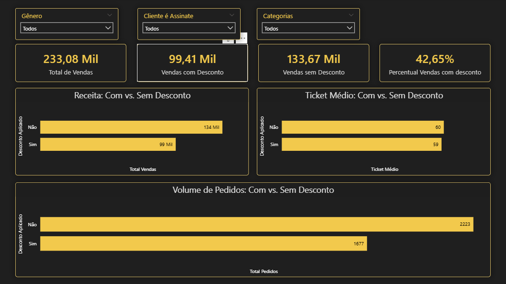

# 📊🛒 Análise de Dados de E-commerce

## 👀 Visão Geral do Projeto
Este projeto tem como objetivo realizar uma **análise exploratória de dados (EDA)** em um conjunto de dados de e-commerce, com foco em **entender o comportamento de compra dos clientes**, identificar padrões de vendas e gerar **insights acionáveis para o negócio**.

O projeto simula um cenário real de atuação de um **Analista de Dados**, passando por limpeza de dados, análise em Python, consultas SQL e interpretação dos resultados sob a ótica de negócio.

O dataset original está disponível no **Kaggle**:  
[*Shopping Behavior and Preferences Study*](https://www.kaggle.com/datasets/ranaghulamnabi/shopping-behavior-and-preferences-study)

---

## 🎯 Problema de Negócio
Empresas de e-commerce precisam responder perguntas estratégicas como:

- Quais categorias e produtos geram mais vendas e receita?
- Quem são os clientes que mais compram?
- Descontos realmente aumentam o ticket médio?
- Onde estão concentrados os principais consumidores?

O desafio deste projeto é **transformar dados brutos de clientes e compras em informações úteis para tomada de decisão** nas áreas de marketing, vendas e estoque.

---

## 📁 Estrutura do Projeto/Repositório

O projeto está organizado da seguinte forma:

- `analytics/` - Notebooks com análises exploratórias e métricas específicas
- `data/` - Datasets utilizados no projeto:
  - `customer.csv` original antes da limpeza
  - `customer_clear` após limpeza
- `src/` - Scripts em Python para limpeza e preparação dos dados
- `sql/` - Consultas SQL utilizadas para responder perguntas de negócio
- `powerbi/` - Arquivos do Power BI utilizados na construção dos dashboards
- `screenshots/` - Imagens dos dashboards utilizadas na documentação

📌 O dashboard em Power BI foi construído a partir dos datasets tratados, que não estão versionados no repositório remoto.

📂 Todos os arquivos, dados não tratados, dados tratados e o arquivo do Power BI, estão disponíveis em um link do Google Drive.

⚠️ Em uma seção específica deste documento, explico como realizar o download do arquivo do dashboard.

---

## 🛠️ O que foi feito

### 🎨 Limpeza e Preparação dos Dados
- Padronização de nomes de colunas
- Normalização de variáveis categóricas (gênero, categoria, localização, etc.)
- Remoção de duplicados
- Renomeação de colunas para melhor legibilidade
- Geração de um dataset limpo (`customer_clear.csv`)

### 🔎 Análise Exploratória em Python
Utilizando **Pandas** e **Matplotlib**, foram realizadas análises como:
- Categorias e itens mais vendidos
- Distribuição de compras por faixa etária
- Comparação de compras por gênero
- Localizações com maior volume de compras
- Visualizações para facilitar interpretação dos dados

### 💾 Análise com SQL
Foram criadas consultas SQL para responder perguntas de negócio, incluindo:
- Ticket médio por categoria
- Volume de vendas por categoria
- Avaliação média dos clientes por categoria
- Impacto de descontos no ticket médio
- Frequência de compras versus valor médio gasto
- Identificação de clientes com maior histórico de compras

---

## 🔍 Principais Descobertas

### 👥 Perfil do Cliente
- A maior concentração de compras está entre clientes de **36 a 65 anos**, com pico entre **51 e 65 anos**.
- O público masculino representa **mais que o dobro** do volume de compras em relação ao feminino.

### 🧾 Produtos e Categorias
- **Roupas** (Clothing) lidera em volume de vendas.
- **Tênis/Sapato** (Footwear) apresenta o maior **ticket médio**.
- Produtos mais vendidos são fortes candidatos à **criação de kits promocionais**..

### 🏷️ Descontos e Ticket Médio
- Compras **sem desconto** possuem ticket médio levemente maior do que compras com desconto.
- Descontos não aumentam o valor médio da compra, mas podem ser usados para aumento de volume.

### 📍 Localização
- As vendas estão distribuídas entre diversos estados, com leve liderança de algumas regiões.
- Não há forte dependência de uma única localização, reduzindo risco regional.

---

## 💡 Impacto no Negócio
Com base nos insights obtidos, este projeto permite apoiar decisões como:

- **Marketing direcionado** ao público masculino entre 36 e 65 anos, destacando qualidade e custo-benefício.
- **Uso estratégico de descontos**, focando em volume de vendas e não em aumento de ticket médio.
- **Gestão de estoque**, priorizando categorias de alto volume e alto valor.
- **Campanhas regionais**, otimizando investimentos em estados com maior retorno.
- **Precificação inteligente**, explorando maior margem em produtos com alta demanda.

---

## 🧰 Tecnologias Utilizadas

| Tecnologia | Finalidade |
|------------|------------|
| **Python** | Transformação e padronização |
| **Pandas** | Manipulação e análise de dados |
| **Matplotlib** | Visualização |
| **Jupyter Notebook** | Desenvolvimento exploratório |
| **SQL** | Consultas analíticas para métricas de negócio |
| **CSV** | Fonte de dados |

---

## 🚀 Possíveis Extensões Futuras

- Análise de métricas avançadas como LTV e churn
- Modelos de previsão de vendas
- Deploy da aplicação 

---

## 📊 Dashboards

### 📌 Visão Executiva

Esta página apresenta uma **visão executiva da performance do e-commerce**, com foco em indicadores estratégicos de vendas e distribuição geográfica, desenvolvida no **Power BI**.

O dashboard foi construído para simular um cenário real de tomada de decisão, permitindo que gestores analisem rapidamente o desempenho geral do negócio.

#### 🔢 Principais métricas exibidas
- Receita total
- Ticket médio
- Total de pedidos
- Total de clientes

#### 📈 Análises disponíveis
- Receita por categoria de produto
- Distribuição de receita por estado (EUA)

#### 🎛️ Filtros interativos
- Gênero do cliente
- Aplicação de desconto
- Status de assinatura

#### 🧠 Principais insights
- A categoria **Roupas** (Clothing) concentra o maior volume de receita, indicando ser o principal motor de vendas.
- A receita está distribuída entre diversos estados, reduzindo a dependência de uma única região.
- O ticket médio permanece estável entre diferentes segmentos, sugerindo consistência no padrão de consumo.

#### 🎯 Objetivo da Visão Executiva
Fornecer uma **visão rápida, clara e estratégica** do negócio, apoiando decisões relacionadas a:
- Prioridade de categorias
- Alocação de investimentos
- Análise regional de vendas
- Monitoramento de KPIs principais

#### 🖼️ Visualização do Dashboard – Visão Executiva

---

### 🏷️ Descontos & Estratégia Comercial

Esta página analisa o **impacto da aplicação de descontos na performance de vendas**, permitindo avaliar se essa estratégia contribui para aumento de receita, volume de pedidos ou ticket médio.

O dashboard apoia decisões relacionadas a **precificação e campanhas promocionais**.

#### 🔢 Principais métricas exibidas
- Receita total
- Receita com desconto
- Receita sem desconto
- Percentual de vendas com desconto

#### 📊 Análises disponíveis
- Comparação de receita entre vendas com e sem desconto
- Ticket médio por aplicação de desconto
- Volume de pedidos com e sem desconto

#### 🎛️ Filtros interativos
- Gênero do cliente
- Cliente é assinante
- Categoria de produto

#### 🧠 Principais insights
- As vendas **sem desconto** apresentam ticket médio ligeiramente superior às vendas com desconto.
- Descontos representam uma parcela relevante da receita total, indicando forte uso da estratégia.
- A aplicação de descontos **não aumenta o ticket médio**, mas contribui para maior volume de pedidos.

#### 🎯 Objetivo da Análise de Descontos
Apoiar decisões sobre:
- Uso estratégico de descontos
- Foco em volume versus valor por pedido
- Segmentação de campanhas promocionais

Os resultados indicam que os descontos devem ser utilizados de forma **tática**, priorizando aumento de volume e giro de estoque.

#### 🖼️ Visualização do Dashboard – Descontos & Estratégia Comercial

---

### 👥 Perfil do Cliente

Esta página tem como objetivo analisar **quem são os clientes do e-commerce** e como diferentes perfis se comportam em relação a volume de pedidos, ticket médio e status de assinatura.

O foco está em compreender padrões demográficos e oportunidades de fidelização.

#### 🔢 Principais métricas exibidas
- Total de clientes
- Ticket médio
- Total de clientes assinantes
- Percentual de clientes assinantes

#### 📊 Análises disponíveis
- Distribuição de clientes por gênero
- Distribuição de clientes por faixa etária
- Volume de pedidos por status de assinatura
- Ticket médio por status de assinatura

#### 🎛️ Filtros interativos
- Gênero
- Categoria de produto
- Estado

#### 🧠 Principais insights
- A base de clientes é majoritariamente **masculina**, concentrada em faixas etárias mais maduras.
- Apenas uma parcela dos clientes possui assinatura, indicando **potencial de crescimento do programa**.
- O ticket médio é semelhante entre assinantes e não assinantes, sugerindo que a assinatura impacta mais a **recorrência** do que o valor por compra.

#### 🎯 Objetivo da Análise de Perfil
Apoiar decisões relacionadas a:
- Estratégias de fidelização
- Conversão de clientes em assinantes
- Segmentação de campanhas por perfil demográfico

#### 🖼️ Visualização do Dashboard – Perfil do Cliente

---

### 📥 Baixar Arquivos do Projeto

[Arquivos do Projeto – Power BI & Datasets](https://drive.google.com/drive/folders/1EPOvfI8xYR4p4trJEWr8T3cQB0zyW3xN?usp=sharing)

📁 Conteúdo:
- `e-commerce.pbix` - Dashboard em Power BI
- `customer_clear.csv` - Dataset tratado utilizado no dashboard
- `customer.csv` - Dataset original (antes da limpeza)

⚠️ Para visualizar o dashboard, é necessário ter o Power BI Desktop instalado.

---

## ✅ Conclusão
Este projeto demonstra a capacidade de **analisar dados, gerar insights relevantes e traduzi-los em impacto real para o negócio**, simulando atividades do dia a dia de um Analista de Dados em um ambiente de e-commerce.

---

## 👨‍💻 Autor

[**Hector Oliveira**](https://www.linkedin.com/in/hectoroliveira-tech/)  
Analista de Dados Júnior  
